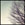

## ブログエンジンBitter

自分のブログ用に、新しいブログエンジン「Bitter」を作りました。このブログもBitterで動いています。

### 特徴

- ローカルからgit pushで投稿
- Markdownで記述
- サーバサイドはNode.jsで、Webサーバも兼ねる
- 文章主体のブログ向け
- 改造しやすいシンプルな構成

### ソースコード

[GitHub](https://github.com/iizukanao/bitter)にあります。Pull Requestも歓迎です。

### インストール

サーバー側で下記のコマンドを入力します。blogdirは、ファイルを置くディレクトリとして読み替えてください。

    $ npm install -g bitter
    $ mkdir blogdir
    $ cd blogdir
    $ bitter setup

次のコマンドでサーバを起動します。環境変数PORTでポート番号を指定します。

    $ PORT=1341 bitter server

nginxやApacheと組み合わせて使う場合はリバースプロキシを使ってください。

ローカル側では、記事ディレクトリをcloneします。

    $ git clone user@host:blogdir/notes.git

### 記事を投稿する

ローカルでcloneした記事ディレクトリ内で、`年/月/日-slug.md`のようなファイル名でMarkdownを作成し、pushすると公開されます。

    $ mkdir -p 2013/05
    $ echo "# Test\n\nHello World" > 2013/05/27-test.md
    $ git add .
    $ git commit -m "add test entry"  # メッセージは何でもOK
    $ git push origin master

### 既存の記事を編集する

    $ vim 2013/05/27-test.md
    $ git add -u
    $ git commit -m update  # メッセージは何でもOK
    $ git push origin master

### 記事を削除する

    $ git rm 2013/05/27-test.md
    $ git commit -m delete  # メッセージは何でもOK
    $ git push origin master

### 画像を埋め込む

記事と同じディレクトリ以下に画像ファイルを置くと、相対パスで参照できます。例えば、2013/05/images/winter.jpgを埋め込むには、2013/05/27-test.mdに次のように書きます。

    

一方、publicディレクトリ以下にファイルを置くと、絶対パスで参照できます。例えば、public/images/spring.jpgを埋め込むには次のように書きます。

    
